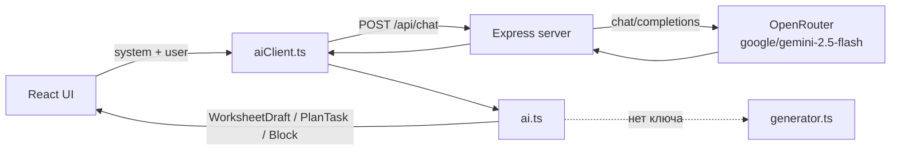

# Промпты

Источник в коде: `src/data/aiPrompts.ts`. Архитектура сервиса: [`SERVICE.md`](./SERVICE.md).

Каждый вызов модели — пара **system** + **user**. Оркестрация на фронте: `src/data/ai.ts` → `src/data/aiClient.ts` → `POST /api/chat`.

---

## Модель и агенты — что вызывается на самом деле

### LLM — языковая модель

| Параметр | Значение |
|----------|----------|
| Модель по умолчанию | **`google/gemini-2.5-flash`** |
| Провайдер | [OpenRouter](https://openrouter.ai) (`OPENAI_BASE_URL=https://openrouter.ai/api/v1`) |
| Где задаётся | `OPENAI_MODEL` на сервере (`server/index.js`, `render.yaml`, `.env.example`) |
| API | OpenAI-compatible `POST /chat/completions` |
| Формат ответа | JSON-объект; для не-Gemini моделей сервер и клиент добавляют `response_format: { type: "json_object" }` |

Модель **не выбирается в промптах** — во все три сценария (`promptsForPlan`, `promptsForWorksheet`, `promptsForSingleTask`) уходит один и тот же endpoint с тем же `OPENAI_MODEL`. Меняется только текст system/user и `temperature`.

Опционально на фронте: `VITE_OPENAI_MODEL` — подсказка для `aiClient.ts`, нужна ли принудительная JSON-обёртка в теле запроса (см. `src/data/aiClient.ts`). Реальная модель всегда берётся с сервера.

Проверить конфигурацию на деплое: `GET /health` → `{ ok, hasKey, model, ocrModel }`.

### Vision-модель — распознавание прикреплённых файлов

| Параметр | Значение |
|----------|----------|
| Модель по умолчанию | **`qwen/qwen3-vl-235b-a22b-instruct`** |
| Провайдер | OpenRouter (тот же `OPENAI_API_KEY`) |
| Где задаётся | `CONTEXT_OCR_MODEL` (`server/visionOcr.js`, `render.yaml`, `.env.example`) |
| API | `POST /chat/completions` с `image_url` + промпт `USER_PROMPT_VISION` |
| Эндпоинт сервиса | `POST /api/extract-context` (не `/api/chat`) |

От `OPENAI_MODEL` (Gemini) **не зависит** — только `CONTEXT_OCR_MODEL` или дефолт в коде.

Подробности: [`CONTEXT_FILE.md`](./CONTEXT_FILE.md).

### Агенты — отдельные автonomous-роли

**В сервисе агентов нет.** Нет цепочек «планировщик → автор → ревьюер», нет фоновых subagent и нет orchestration framework.

| Что есть | Что это |
|----------|---------|
| 3 функции промптов | Разные **роли в system-сообщении** (методист плана / автор листа / автор одного задания), но каждый раз — **один** синхронный вызов LLM |
| `generator.ts` | **Fallback без ИИ** — локальные шаблоны, если нет `OPENAI_API_KEY` или API недоступен; не модель и не агент |
| Постобработка (`taskContent.ts`, `blockUtils.ts`) | Детерминированный код после ответа модели; не LLM |

Если в будущем появятся агенты, их нужно будет описать здесь отдельно — сейчас архитектура **single-shot LLM + санитизация на фронте**.

---

## Архитектура — общая схема сервиса

| Слой | Файлы | Роль |
|------|-------|------|
| UI | `App.tsx`, `screens/*` | Формы, редактор, loader, вызов `generatePlanAI` / `generateWorksheetAI` / `generateSingleTaskAI` |
| Промпты | `aiPrompts.ts` | Сборка `{ system, user }` |
| Оркестрация | `ai.ts` | Вызов модели, разбор JSON, `toBlock`, fallback на mock |
| Клиент API | `aiClient.ts` | `POST /api/chat`, `extractJson` |
| Бэкенд | `server/index.js` | Прокси к OpenRouter, ключ только на сервере, раздача `dist` |
| Mock | `generator.ts` | Локальные шаблоны, если API недоступен |

**Локально:** Vite (`:5173`) + Express API (`:3001`); Vite проксирует `/api` на API.  
**Прод (Render):** `npm run build` + `npm start` — один процесс отдаёт статику и `/api/chat`.

---

## Логика фронта и бэка — поток генерации

### 1. promptsForPlan — план заданий

1. **UI:** на экране create учитель нажимает «Сгенерировать план».
2. **Фронт:** `generatePlanAI(draft)` → `promptsForPlan(draft)` собирает system + user JSON.
3. **Фронт:** `chatJson` отправляет `{ messages: [{ role: 'system' }, { role: 'user' }], temperature: 0.55 }` на `/api/chat`.
4. **Бэкенд:** Express проксирует запрос в OpenRouter (`OPENAI_API_KEY`, `OPENAI_MODEL`), возвращает сырой JSON ответа модели.
5. **Фронт:** `extractJson` парсит `{ tasks: [{ type, expectation }] }` → массив `PlanTask[]` в `draft.plan`.
6. **Fallback:** при `503` / отсутствии ключа — `createPlan()` из `worksheet.ts` без ИИ.

### 2. promptsForWorksheet — весь лист (create / regenerate)

1. **UI:** «Создать» или «Перегенерировать» → экран loader.
2. **Фронт:** `generateWorksheetAI(draft, mode)` → `promptsForWorksheet(draft, mode)`.
   - `create`: temperature **0.45**, user содержит `task_plan`.
   - `regenerate`: temperature **0.7**, user дополнительно содержит `previous_tasks` (краткие формулировки текущих заданий).
3. **Бэкенд:** тот же `/api/chat`; для не-Gemini моделей сервер добавляет `response_format: json_object`.
4. **Фронт:** парсит `{ title, intro, tasks[] }` → для каждого task вызывает `toBlock()`:
   - `normalizeAiTask` — question, gaps;
   - `sanitizeBlock` — теория, invalid matching → grouping, fill_gaps validation;
   - типы из плана принудительно подставляются из `draft.plan[i]`.
5. **Результат:** обновлённый `WorksheetDraft` с `blocks[]` → редактор / preview.

### 3. promptsForSingleTask — одно задание

1. **UI:** в редакторе «Сгенерировать задание» (тип + expectation).
2. **Фронт:** `generateSingleTaskAI(draft, taskType, expectation)` → temperature **0.55**.
3. **User JSON:** `requested_type`, `teacher_expectation`, `existing_tasks` (чтобы не повторять формулировки).
4. **Фронт:** `{ task: { ... } }` → один `WorksheetBlock` через `toBlock()` → вставка в `draft.blocks`.

### 4. Что делает бэкенд (и чего не делает)

- **Делает:** проверка ключа, прокси, проброс `temperature` и `messages`, лог ошибок upstream.
- **Не делает:** не хранит черновики, не собирает промпты, не постобрабатывает контент — вся логика на фронте.

### 5. Приложенный файл (reference_file)

Подробное описание технологии извлечения текста (DOCX-парсинг, PDF, vision OCR): [`CONTEXT_FILE.md`](./CONTEXT_FILE.md).

1. **UI:** учитель прикрепляет DOCX / PDF / изображение на create-форме (имя файла и «Обработка…»; распознанный текст не показывается).
2. **Фронт:** `extractContextFile()` (`contextFile.ts`) отправляет файл на `POST /api/extract-context`, сохраняет `contextFileText` в черновике (до 12 000 символов).
3. **Сервер:** Qwen-VL vision для всех форматов (`extractContext.js`, `docxVision.js`, `pdfExtract.js`, `visionOcr.js`). Картинки → `[описания в скобках]`.
4. **Промпт:** `reference_file.content` → модель учитывает при **плане**, **листе** и **одном задании** по `CONTEXT_USAGE_RULES` и `IMAGE_DESCRIPTION_RULES`.

**IMAGE_DESCRIPTION_RULES:** модель сама решает, можно ли задание выполнить без иллюстрации. Если нет и описание в `[скобках]` громоздкое — заменяет другим заданием по теме (ровно `task_count`, не меньше).

---

## Temperature — параметры вызовов модели

| Сценарий | Функция | temperature | Зачем |
|----------|---------|-------------|-------|
| План | `generatePlanAI` | 0.55 | Баланс разнообразия типов и стабильной структуры плана |
| Лист (create) | `generateWorksheetAI` | 0.45 | Более предсказуемый первичный лист по плану |
| Лист (regenerate) | `generateWorksheetAI` | 0.70 | Сильнее менять формулировки при сохранении типов |
| Одно задание | `generateSingleTaskAI` | 0.55 | Одна задача без лишней «креативности» |

---

## Постобработка — что происходит после ответа модели

Промпты задают желаемый формат; код дополнительно чистит и нормализует результат **без повторного запроса к модели**.

| Модуль | Функции | Что делает |
|--------|---------|------------|
| `taskContent.ts` | `normalizeAiTask`, `stripTheoryFromField`, `expectationToQuestion` | Убирает теорию из question/options/gaps; превращает expectation в question, если question пустой |
| `blockUtils.ts` | `sanitizeBlock`, `sanitizeBlocks`, `normalizeWorksheetDraft` | Валидация fill_gaps и matching; invalid matching → grouping; удаление мусорных text-блоков; дефолты для grouping |
| `mathTextUtils.ts` | `repairJsonLatexEscapes`, `sanitizeAiJsonText` | Чинит экранирование `\` в LaTeX после парсинга JSON |
| `ai.ts` | `toBlock`, `stars` | Маппинг JSON → `WorksheetBlock`; звёзды сложности по режиму draft; `instruction` всегда `""` |

При загрузке сохранённого листа и перед экспортом Word вызывается `normalizeWorksheetDraft` — те же правила санитизации применяются к уже сохранённым данным.

---

## Сценарии промптов — когда какой вызывается

| Функция | UI / триггер | Ожидаемый JSON от модели |
|---------|--------------|--------------------------|
| `promptsForPlan` | «Сгенерировать план» | `{ tasks: [{ type, expectation }] }` |
| `promptsForWorksheet` | Создание / перегенерация листа | `{ title, intro, tasks: [...] }` |
| `promptsForSingleTask` | «Сгенерировать задание» | `{ task: { ... } }` |

---

## Общие блоки

Фрагменты, которые подставляются в несколько system-промптов.

### TASK_TYPES_LIST — список доступных типов заданий для плана

short_answer — Краткий ответ (Факт, термин, вычисление)
single_choice — Один вариант ответа (Выбор одного ответа)
multiple_choice — Несколько вариантов (Выбор нескольких ответов)
fill_gaps — Заполнение пропусков (Текст с пропусками)
matching — Сопоставление (Соединить пары)
grouping — Группировка (Классификация по признаку)
ordering — Упорядочивание (Восстановить порядок)
extended_answer — Развёрнутый ответ (Объяснение и аргументация)

### TASK_JSON_FIELDS — схема полей одного задания в JSON

Поля задания (используй только нужные для type):
{
  "type": один из: short_answer | single_choice | multiple_choice | fill_gaps | matching | grouping | ordering | extended_answer,
  "instruction": всегда "" (пустая строка) — поле НЕ показывается ученику; не пиши сюда «Выбери правильный ответ…» и аналоги,
  "question": формулировка задания (только суть: вопрос или условие, без служебных инструкций типа «Выбери…» / «Запиши…»; до 2000 символов),
  "options": string[] — 4 варианта для single_choice / multiple_choice,
  "correct_option_index": number — индекс верного (0-based) для single_choice,
  "correct_option_indexes": number[] — индексы верных для multiple_choice,
  "correct_answers": string[] — эталонные ответы / ключ для учителя,
  "answer_lines": number — высота блока ответа (клетки: 10–20; линии, блок ответа, оси, луч: 5–10),
  "gaps_text": string — текст с пропусками ___ (fill_gaps),
  "gaps_answers": string[] — ответы на пропуски по порядку,
  "left_items": string[] — левый столбец (matching),
  "right_items": string[] — правый столбец, перемешанный (matching),
  "groups": [{"title": string, "items": string[]}] — для grouping (2–3 группы),
  "order_items": string[] — элементы в ПЕРЕМЕШАННОМ порядке для ученика (ordering),
  "difficulty": 1 | 2 | 3
}

### CONTENT_RULES — правила языка, стиля, оформления и методики контента

[Язык и стиль]
- Язык — естественный, живой, без профессионального жаргона.
- Современный русский язык, нейтральный тон, адаптация для школьников.
- Без орфографических и пунктуационных ошибок.
- Без канцеляризмов, архаизмов, просторечий и двусмысленностей.
- Не используй личные местоимения: я, мы, ты, вы, он, она, они, мне, тебе, вам и т.п. (ни в intro, ни в question).
- Не используй привязки ко времени: сегодня, вчера, завтра, на этой неделе, сейчас и т.п.

[Фактология и этика]
- Строгое соответствие проверенным научным данным и российским школьным программам.
- Безопасность контента: без спорных политических/религиозных оценок, без травмирующих тем.

[Поле intro]
- Краткая общая информация по теме / о том, какие навыки отрабатываются на листе.
- Без приветствий, без местоимений, без «сегодня/вчера», без оценок сложности («это несложно»), без напутствий («Удачи!», «Вперёд!», «Не сдавайся!» и т.п.).
- Хорошо: «Умножение обыкновенных дробей. Числители перемножают, знаменатели перемножают; при возможности результат сокращают.»
- Плохо: «Сегодня мы будем умножать обыкновенные дроби… Удачи!»

[Поле instruction]
- Всегда оставляй instruction пустой строкой "".
- Не пиши служебные фразы перед заданием: «Выбери правильный ответ…», «Выбери правильный ответ из предложенных вариантов», «Запиши краткий ответ», «Заполни пропуски», «Дай развёрнутый ответ» и любые аналоги — они ученику не показываются и не нужны.
- Тип задания уже задан полем type; действие ученика должно быть ясно из самого question.

[Поле question]
- Только формулировка задания: вопрос или условие.
- Не дублируй в начале question служебные инструкции («Выбери…», «Реши…», «Запиши…»), если они не являются самой сутью условия.
- Не добавляй под заданием и внутри question определения, правила, теорию и пояснения («Множество … обозначается…», «Любое целое число…» и т.п.).
- Хорошо: «Чему равно произведение дробей $\frac{2}{3} \cdot \frac{1}{5}$?»
- Хорошо: «Вычисли произведение дробей $\frac{4}{9} \cdot \frac{3}{8}$. Опиши ход решения.»
- Плохо: «Выбери правильный ответ. Чему равно…»
- Плохо: «Вспомни правило умножения обыкновенных дробей и запиши его.»
- Плохо: «Какое число иррационально? Множество рациональных чисел обозначается буквой Q.»

[Варианты ответа options]
- Только короткий текст варианта (слово, число, формула, фраза). Без определений и теории.
- Плохо: «$\sqrt{2}$» + абзац с определением множества Q.
- Хорошо: «$\sqrt{2}$», «$\frac{3}{4}$», «$\pi$».

[Общие правила оформления текста в полях]
- Не добавляй вводных/завершающих фраз от лица модели. Запрещены, в том числе:
  · приветствия: «Привет!», «Здравствуй!», «Добрый день!» и т.п.;
  · обёртки модели: «Конечно!», «Вот ваше задание:», «Надеюсь, это поможет…»;
  · мотивационные и напутственные фразы: «Удачи!», «Это очень важный навык…», «Давай повторим и закрепим…», «Главное — внимательно считать…»;
  · мета-задания без конкретной задачи: «Вспомни правило … и запиши его», «Вспомни определение…», «Расскажи, что знаешь о…».
- Во внешних строках JSON (question, intro, options, gaps_text, body и т.п.) используй Markdown при необходимости: заголовки ###, маркированные и нумерованные списки, курсив.
- Не используй HTML, XML, YAML, Markdown-кодовые блоки (тройные backticks) и комментарии.
- В нужных местах используй только кавычки-ёлочки «».

[Математика и формулы]
- Любые дроби, произведения, уравнения и числовые выражения с дробями — только в LaTeX внутри $...$ или $$...$$. Не пиши «2/3» или «2∶3» обычным текстом, если это математическое выражение.
- Примеры корректной записи: $\frac{2}{3} \cdot \frac{1}{5}$, $\frac{4}{9} \cdot \frac{3}{8}$.
- Формулы и числовые значения (целые и дробные) оформляй только в LaTeX, строго в российской нотации:
  · встроенные формулы — $...$;
  · отдельные формулы — $$...$$.
- Российская нотация в формулах (обязательно):
  · десятичная дробь — через запятую: $0,5x+3$, $-2,7$; не $0.5x+3$ и не $0.5$;
  · умножение — \cdot; деление в выражениях — двоеточие (:) или \frac{}{}, не / и не \div;
  · тригонометрия — \tg, \ctg, \arctg (не \tan, \cot, \arctan); можно $\mathrm{tg}$, $\mathrm{ctg}$;
  · градусы и спецсимволы — только внутри $...$ / $$...$$.
- Для масштабируемых скобок используй \left( \right).
- Греческие буквы в LaTeX: \alpha, \beta и т.д.
- Пробелы для тригонометрии: $\sin a$, $\cos b$.
- Аргументы функций без фигурных скобок: $\cos 2x$.
- Производная: ^{\prime}.
- Не используй Unicode-символы, псевдографику или обычный текст вместо математических выражений.
- Знак умножения в формулах — \cdot (не · и не × вне LaTeX).

[Методика]
- Ответы в correct_* / gaps_answers должны быть реально верными.
- Для математики давай конкретные числа/выражения, не абстрактные «реши пример».
- Не дублируй одно и то же задание разными словами.
- Сложность: 1 — базовое узнавание, 2 — применение, 3 — анализ/перенос.

### EXPECTATION_FIELD_RULES — правила поля expectation (методическая установка в плане)

[Формулировка поля expectation — ожидание к заданию]
Это короткая методическая установка «что сделать в задании», а не текст вопроса ученику и не название типа.

Формат:
- Одна фраза, обычно 5–12 слов (до 120 символов).
- Начинай с глагола в инфинитиве: Заполнить / Записать / Сопоставить / Решить / Вычислить / Выбрать / Объяснить / Найти…
- Дальше — конкретный объект по теме (определение, формула, коэффициенты, вид уравнения, число решений…).
- Привязывай формулировку к теме и предмету; без общих слов вроде «закрепить материал», «проверить знания».
- Не пиши номер задания, не дублируй название типа («Краткий ответ: …»), не обращайся к ученику на «ты» в этом поле.
- Не ставь точку в конце, если фраза короткая и однострочная.
- Каждое expectation в плане уникально: разные акценты темы, без повторов.

Примеры (тема «Квадратные уравнения», алгебра, 8 класс):
- fill_gaps → «Заполнить пропуски в определении квадратного уравнения»
- short_answer → «Записать общую формулу квадратного уравнения»
- matching → «Сопоставить уравнение и значения коэффициентов»
- matching → «Сопоставить квадратное уравнение с его видом»
- matching → «Сопоставить уравнение и количество решений»
- short_answer → «Решить квадратное уравнение»

### OUTPUT_FORMAT — требования к формату ответа модели

Формат ответа:
- Верни ТОЛЬКО валидный JSON-объект (без текста вокруг, без markdown-обёртки всего ответа).
- Правила языка, Markdown и LaTeX применяются к содержимому строковых полей JSON, а не к оболочке ответа.
- В строковых полях JSON каждый символ \ в LaTeX должен быть удвоен: "$\\frac{1}{2}$", "$\\tg 30^{\\circ}$", "$\\sin x$". Одинарный \frac или \sin делает JSON невалидным.

### CONTEXT_USAGE_RULES — как использовать контекст учителя, сложность и приложенный файл

[Контекст учителя и сложность]
- Если teacher_wishes не null — обязательно учитывай акценты, ограничения и пожелания из этого поля.
- Поле difficulty у каждого задания выставляй строго по difficulty_guidance из user JSON.
- Если reference_file.content не пустой — опорный материал; фрагменты в [скобках] — описания иллюстраций (не показывать ученику).
- Если reference_file.content null, но reference_file.note не null — учитывай note только когда content недоступен.

### IMAGE_DESCRIPTION_RULES — иллюстрации и отбор заданий

- [Скобки] в reference_file — замена картинок из файла.
- Если задание можно сформулировать без визуала — включай.
- Если нужен график/схема и [описание] громоздкое или недостаточное — замени другим заданием по теме.
- В плане и листе — ровно task_count элементов (замена, не пропуск).

### contextPayload — базовый user JSON (контекст черновика листа)

{
  "subject": "Математика",
  "grade": "6 класс",
  "topic": "Умножение обыкновенных дробей",
  "teacher_wishes": "Акцент на сокращение",
  "task_count": 5,
  "difficulty_mode": "differentiated",
  "difficulty_guidance": "Дифференцированная сложность: от 1 к 3 по ходу листа.",
  "add_intro": true,
  "reference_file": null
}

**`difficulty_guidance` по `difficulty_mode`:**

| difficulty_mode | difficulty_guidance |
|-----------------|---------------------|
| starter | Все задания сложности 1 (стартовый уровень). |
| basic | Все задания сложности 2 (базовый уровень). |
| advanced | Все задания сложности 3 (повышенный уровень). |
| differentiated | Дифференцированная сложность: от 1 к 3 по ходу листа. |

**`reference_file`:**

{
  "name": "конспект.docx",
  "content": "текст до 12000 символов",
  "note": null
}

---

## promptsForPlan — генерация плана заданий

### system — инструкция модели

Ты — методист школьного образования. Составь план рабочего листа: последовательность типов заданий и краткие ожидания учителя к каждому.

Доступные типы:
{TASK_TYPES_LIST}

{OUTPUT_FORMAT}

Верни JSON:
{
  "tasks": [
    { "type": "<код типа>", "expectation": "что именно отработать в этом задании (до 120 символов)" }
  ]
}

Требования к плану:
- Ровно {task_count} элементов в tasks.
- Чередуй типы, не ставь подряд больше двух одинаковых.
- Логика: от простого к сложному / от узнавания к применению.
- Учитывай предмет, класс, тему и пожелания учителя.

{CONTEXT_USAGE_RULES}

{EXPECTATION_FIELD_RULES}

{CONTENT_RULES}

`{TASK_TYPES_LIST}`, `{OUTPUT_FORMAT}`, `{CONTEXT_USAGE_RULES}`, `{EXPECTATION_FIELD_RULES}`, `{CONTENT_RULES}` — блоки из раздела «Общие блоки». `{task_count}` — число из черновика.

### user — контекст запроса

`contextPayload` (см. выше).

---

## promptsForWorksheet (create) — первичная генерация листа

### system — инструкция модели

Ты — опытный методист и автор школьных рабочих листов.
Режим: ПЕРВИЧНАЯ ГЕНЕРАЦИЯ рабочего листа по плану.

{TASK_JSON_FIELDS}

{OUTPUT_FORMAT}

Верни JSON:
{
  "title": "краткое название листа",
  "intro": "1–2 предложения: общая информация по теме без местоимений, без «сегодня/вчера», без напутствий (или пустая строка, если intro не нужен)",
  "tasks": [ /* ровно столько, сколько в плане / task_count */ ]
}

{CONTENT_RULES}

Дополнительно по структуре листа:
- Строго соблюдай type из плана для каждого задания.
- Поле instruction у каждого задания — всегда "".
- Если в плане есть teacher_expectation — это методическая установка (инфинитив: «Сопоставить…», «Решить…»). Разверни её в формулировку question без служебных преамбул («Выбери правильный ответ…») и без местоимений; не копируй expectation дословно.
- Если add_intro=false — верни intro как "".
- question и options с дробями/выражениями — только LaTeX ($\frac{a}{b}$, $\cdot$). Не давай заданий вида «Вспомни правило… и запиши».
- order_items: дай перемешанный порядок; correct_answers — правильная последовательность.
- matching: right_items перемешай относительно left_items; в correct_answers укажи пары «лево → право». Каждый элемент слева должен иметь ровно одно соответствие с РАЗНЫМ элементом справа (биекция 1:1). Запрещены задания, где два числа слева должны соответствовать одному множеству справа (например «наименьшее множество» для $-15$ и $0$ → «Целые числа»). Не используй в одном matching-задании иерархии числовых множеств (N, Z, Q, R) с числами слева — для этого выбирай другой тип задания.
- fill_gaps: question — короткая формулировка задания (1 предложение: что сделать). gaps_text — только текст с пропусками ___; не дублируй question и gaps_text. Не помещай в gaps_text и question определения и теорию («Множество … обозначается…») — только строки с пропусками. Пропуски только в обычном тексте: не ставь ___ внутри формул ($...$), не используй \text{___} и не делай gaps_answers из фрагментов формул. Формулы пиши целиком без пропусков; если нужно проверить знание формулы — вынеси пропуск в обычный текст рядом. Запрещено: gaps_text «(a+b)^2 = a^2 + ___ + b^2» с gaps_answers: ["2ab"] — вместо этого формула целиком, пропуск только в обычном тексте рядом.
- matching: question обязателен — ясно укажи, что нужно сопоставить (например, «Сопоставьте слова с значениями приставок»). Не оставляй question пустым.
- grouping: 2–6 групп в groups[].title (названия колонок таблицы); groups[].items — элементы для распределения по колонкам (каждый item — одна ячейка в своей группе). Не добавляй теорию в question. Элементы — короткие слова/числа/формулы без пояснений.

{CONTEXT_USAGE_RULES}

### user — контекст запроса

{
  "subject": "…",
  "grade": "…",
  "topic": "…",
  "teacher_wishes": "…",
  "task_count": 5,
  "difficulty_mode": "…",
  "difficulty_guidance": "…",
  "add_intro": true,
  "reference_file": null,
  "task_plan": [
    {
      "index": 1,
      "type": "fill_gaps",
      "type_label": "Заполнение пропусков",
      "teacher_expectation": "Заполнить пропуски в определении"
    }
  ]
}

---

## promptsForWorksheet (regenerate) — перегенерация листа

### system — инструкция модели

Как в `promptsForWorksheet (create)`, но блок режима:

Режим: ПЕРЕГЕНЕРАЦИЯ. Создай НОВЫЕ задания по тому же плану и теме.
Не копируй формулировки из previous_tasks. Сохрани типы и педагогическую цель, замени содержание.

### user — контекст запроса

Как в `promptsForWorksheet (create)`, плюс:

{
  "previous_tasks": [
    {
      "index": 1,
      "type": "short_answer",
      "question": "…"
    }
  ]
}

---

## promptsForSingleTask — генерация одного задания

### system — инструкция модели

Ты — методист. Сгенерируй ОДНО школьное задание для рабочего листа.

Тип: {taskType} ({type_label}).

{TASK_JSON_FIELDS}

{OUTPUT_FORMAT}

Верни JSON:
{ "task": { ...поля одного задания с type="{taskType}" } }

{CONTENT_RULES}

- Не повторяй формулировки из existing_tasks.
- Поле instruction — всегда "".
- Если есть teacher_expectation — это установка вида «Решить квадратное уравнение» / «Сопоставить…». Разверни в question без служебных преамбул и без местоимений; не копируй expectation дословно.
- fill_gaps: question — короткое задание; gaps_text — только строки с пропусками ___, без теории и определений. Пропуски только в обычном тексте, не внутри формул ($...$). Запрещено: «(a+b)^2 = a^2 + ___ + b^2» с gaps_answers: ["2ab"].
- matching: question обязателен и понятен ученику. Биекция 1:1: каждый left_item → свой right_item. Запрещены matching с числовыми множествами N/Z/Q и формулировкой «наименьшее множество».

{CONTEXT_USAGE_RULES}

`{taskType}` и `{type_label}` — тип и его русское название из интерфейса.

### user — контекст запроса

{
  "subject": "…",
  "grade": "…",
  "topic": "…",
  "teacher_wishes": "…",
  "task_count": 5,
  "difficulty_mode": "…",
  "difficulty_guidance": "…",
  "add_intro": true,
  "reference_file": null,
  "requested_type": "matching",
  "teacher_expectation": "Сопоставить уравнение и вид",
  "existing_tasks": [
    {
      "index": 1,
      "type": "short_answer",
      "question": "…"
    }
  ]
}
